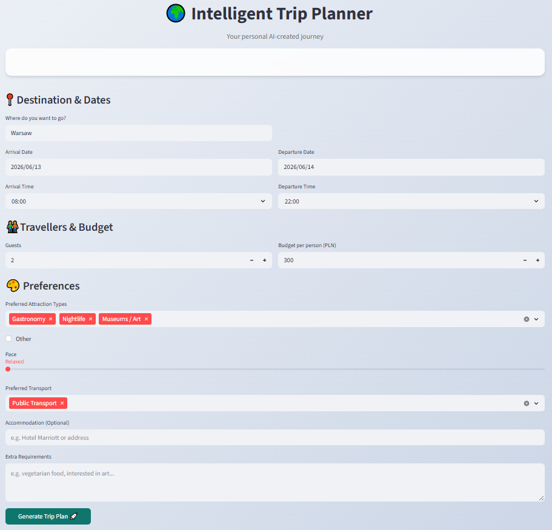
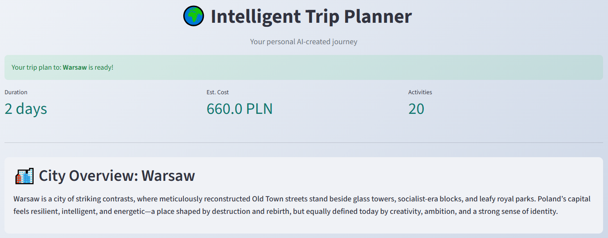
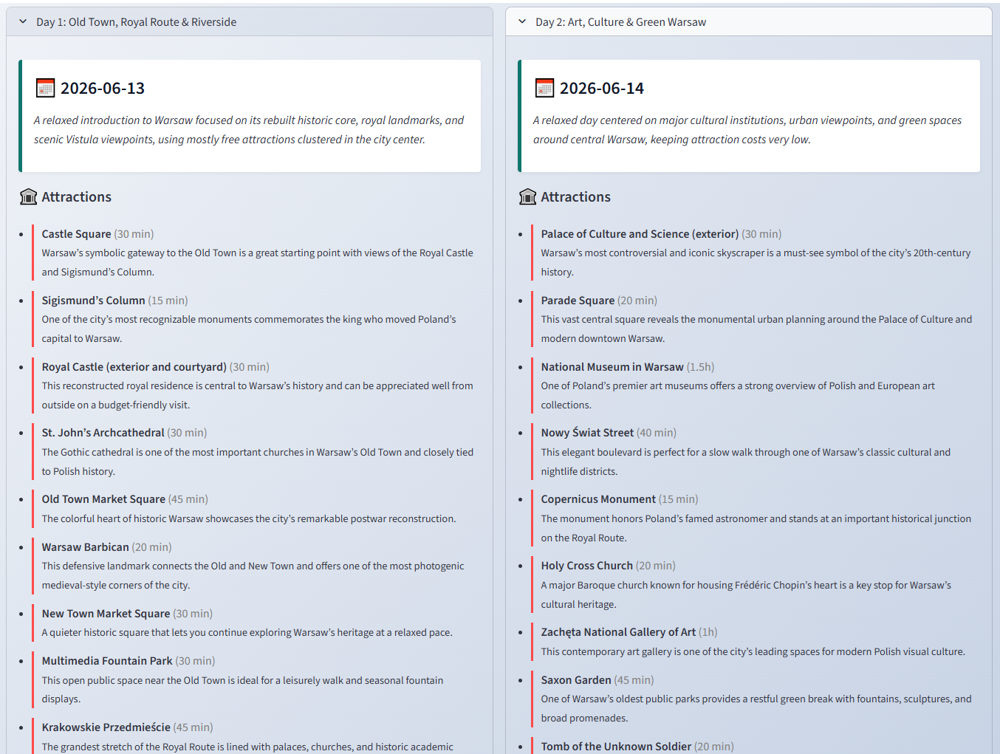
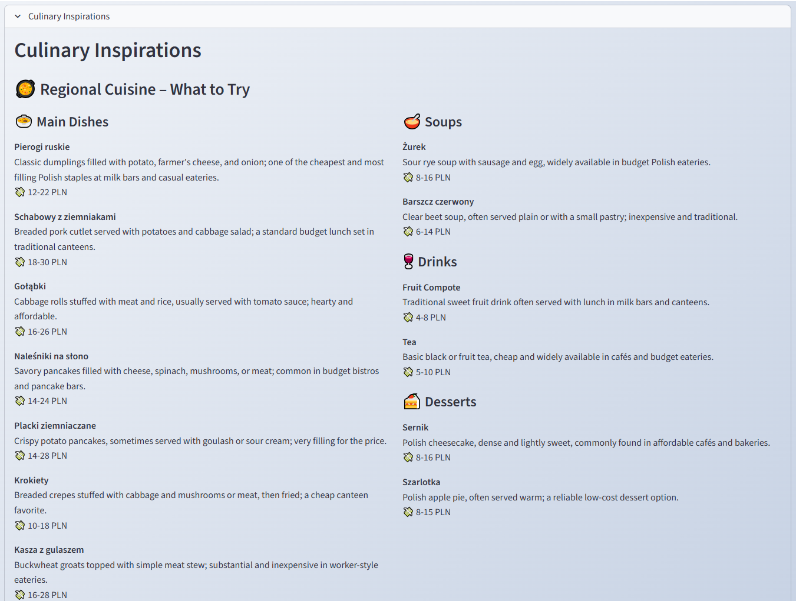
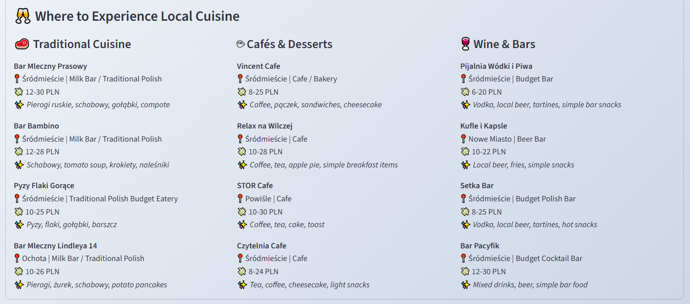
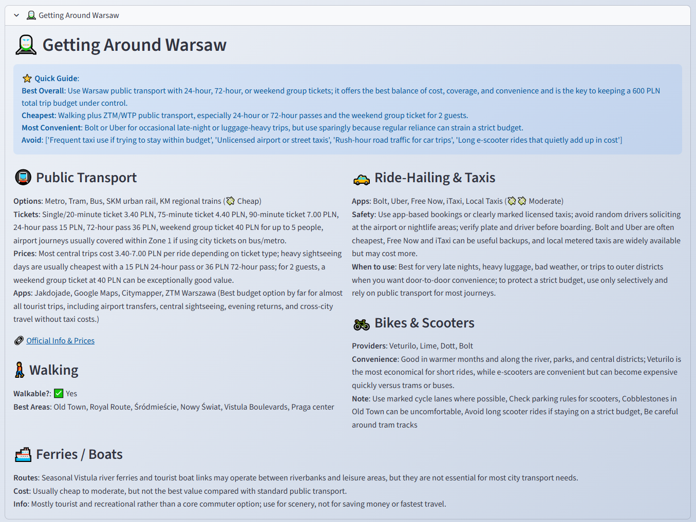
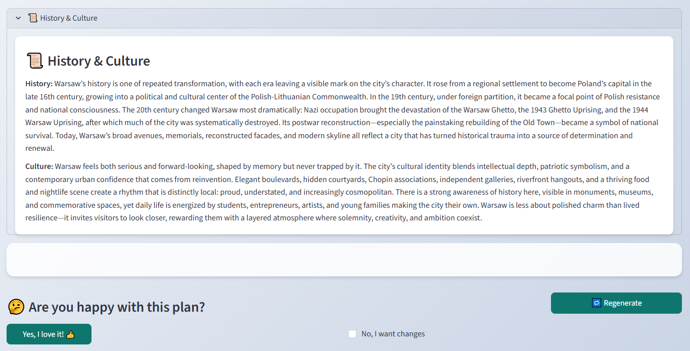
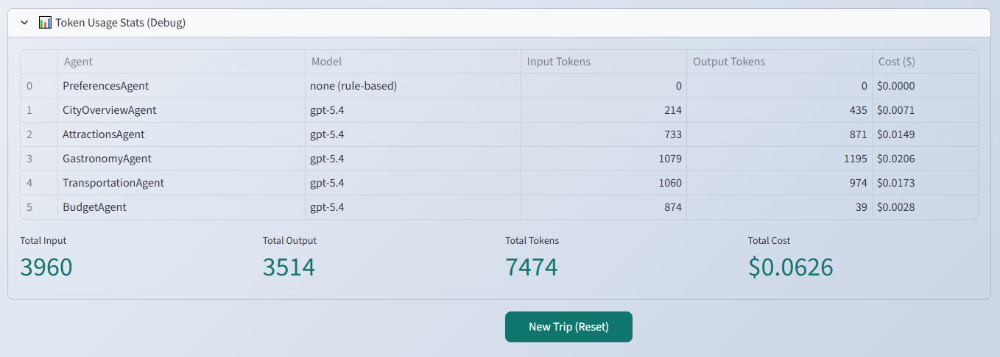

<div align="center">

# 🌍 Intelligent Trip Planner

### AI-Powered Travel Planning with a Multi-Agent System

*Master's Thesis Project - Multi-Agent Architecture × Large Language Models*


</div>

## 📌 About the Project

**Intelligent Trip Planner** is a full-stack application that generates personalized, multi-day travel itineraries using a **Multi-Agent System (MAS)** orchestrated by Large Language Models. Built as a Master's Thesis, the project explores how autonomous AI agents can collaboratively solve complex planning tasks.

The user provides trip parameters (destination, dates, budget, preferences), and the system dispatches **6 specialized agents** that work concurrently - each responsible for a different domain of travel planning. The agents communicate via a shared **WorldState** and an **Event Bus**, producing a comprehensive plan that includes day-by-day activities, culinary recommendations, mobility guides, and budget breakdowns.

The application supports **3 LLM providers** (Google Gemini, OpenAI, Anthropic) and includes a **benchmark suite** for systematic comparison of model performance across cost, latency, and output quality.

---

## 🛠️ Technology Stack

| Layer | Technology |
|---|---|
| **Language** | Python 3.11 |
| **Backend API** | FastAPI, Uvicorn, Pydantic |
| **Frontend** | Streamlit |
| **LLM Providers** | Google Gemini, OpenAI GPT, Anthropic Claude |
| **Agent Architecture** | Custom Multi-Agent System (Orchestrator pattern) |
| **Communication** | In-memory Event Bus, Shared WorldState |
| **Testing** | pytest, pytest-asyncio, Selenium |
| **Containerization** | Docker, Docker Compose |
| **Infrastructure** | Terraform (AWS + GCP) |
| **Cloud - GCP** | Cloud Run, Artifact Registry, Secret Manager, VPC |
| **Cloud - AWS** | ECS Fargate, ECR, ALB, SSM Parameter Store, CloudWatch |
| **CI/CD** | GitHub Actions (test → build → push → deploy) |

---

## 🖼️ Screenshots

### 📸 Application Input Form



### 📸 Trip Summary and Destination City Overview



### 📸 Generated Day-by-Day Sightseeing Itinerary



### 📸 Culinary Inspirations and Recommended Local Dishes



### 📸 Personalized Restaurant Recommendations



### 📸 Urban Transportation Information Module



### 📸 Historical and Cultural Overview of the Region



### 📸 LLM Token Usage Statistics



---

## ✨ Key Features

- 🤖 **Multi-Agent System** - 6 specialized agents (Preferences, Attractions, Gastronomy, Transportation, Budget, City Overview) work concurrently to build a complete plan
- 🔄 **Feedback Loop** - Refine generated plans with natural language feedback without starting from scratch
- 🧠 **Multi-LLM Support** - Switch between Gemini 3.5 Flash, GPT-5.4, and Claude Sonnet 4.6 at runtime
- 🍽️ **Culinary Section** - Local dishes, soups, desserts, drinks, plus curated venue recommendations by district
- 🚇 **Mobility Guide** - Public transport, taxis, walking, bikes, ferries, car rental - with pricing and "best for" tips
- 🏛️ **City Overview** - Historical summary, cultural identity, and short description of the destination
- 💰 **Budget Tracking** - Per-day cost estimates and total trip cost aligned with user budget
- 📊 **LLM Benchmark Suite** - Automated comparison of models across latency, token usage, cost, and output quality
- 🐳 **Fully Dockerized** - Multi-stage Docker builds for both backend and frontend
- ☁️ **Dual-Cloud Deployment** - Infrastructure-as-Code for both AWS (ECS Fargate) and GCP (Cloud Run)
- 🔁 **CI/CD Pipelines** - GitHub Actions with path-based filtering, automated tests, and gated deployments
- 🔐 **Secure Secrets** - API keys stored in AWS SSM Parameter Store / GCP Secret Manager

---

## 🏗️ System Architecture

```
┌──────────────────────────────────────────────────────────────┐
│                     Streamlit Frontend                       │
│                      (localhost:8501)                        │
│   ┌────────────┐  ┌───────────────┐  ┌────────────────┐      │
│   │ Trip Form  │  │  Results View │  │ Feedback Panel │      │
│   └────────────┘  └───────────────┘  └────────────────┘      │
└────────────────────────┬─────────────────────────────────────┘
                         │ HTTP (REST)
                         ▼
┌──────────────────────────────────────────────────────────────┐
│                    FastAPI Backend                           │
│                     (localhost:8000)                         │
│                                                              │
│   /generate_plan ──► OrchestratorAgent                       │
│   /update_plan   ──► FeedbackAgent ──► OrchestratorAgent     │
│                            │                                 │
│              ┌─────────────┼─────────────┐                   │
│              ▼             ▼             ▼                   │
│    ┌──────────────┐ ┌────────────┐ ┌──────────────┐          │
│    │ Preferences  │ │Attractions │ │  Gastronomy  │          │
│    │    Agent     │ │   Agent    │ │    Agent     │          │
│    └──────┬───────┘ └─────┬──────┘ └──────┬───────┘          │
│           │               │               │                  │
│    ┌──────┴───────┐ ┌─────┴──────┐ ┌──────┴───────┐          │
│    │Transportation│ │   Budget   │ │City Overview │          │
│    │    Agent     │ │   Agent    │ │    Agent     │          │
│    └──────────────┘ └────────────┘ └──────────────┘          │
│              │             │             │                   │
│              └─────────────┼─────────────┘                   │
│                            ▼                                 │
│                ┌───────────────────────┐                     │
│                │  Shared WorldState    │◄── Event Bus        │
│                │  (async lock-safe)    │    (pub/sub)        │
│                └───────────────────────┘                     │
│                            │                                 │
│              ┌─────────────┼─────────────┐                   │
│              ▼             ▼             ▼                   │
│         ┌─────────┐  ┌─────────┐  ┌──────────┐               │
│         │ Gemini  │  │  GPT    │  │  Claude  │               │
│         │Provider │  │Provider │  │ Provider │               │
│         └─────────┘  └─────────┘  └──────────┘               │
└──────────────────────────────────────────────────────────────┘
```

---

## 🤖 Agent Overview

| Agent | Responsibility | Dependencies |
|---|---|---|
| **PreferencesAgent** | Analyzes user input and sets constraints (pace, themes, budget allocation) | - |
| **AttractionsAgent** | Generates day-by-day activities and itinerary | PreferencesAgent |
| **GastronomyAgent** | Curates local dishes, venues, cafés, and bars | - |
| **TransportationAgent** | Builds a mobility guide with transport options and pricing | - |
| **BudgetAgent** | Estimates per-day and total costs based on plan content | AttractionsAgent |
| **CityOverviewAgent** | Provides city history, culture, and identity summary | - |

All agents run **concurrently** using `asyncio`. The **Event Bus** coordinates dependencies - e.g., the Budget Agent subscribes to the `attractions_ready` event before computing costs.

---

## 🚀 Getting Started

### Prerequisites

- Python 3.11+
- Docker & Docker Compose
- API keys for at least one LLM provider

### 1. Clone & Configure

```bash
git clone https://github.com/your-username/trip-planner.git
cd trip-planner
```

Create a `.env` file in the project root:

```env
GOOGLE_API_KEY=your_google_api_key
OPENAI_API_KEY=your_openai_api_key
ANTHROPIC_API_KEY=your_anthropic_api_key
```

### 2. Run with Docker Compose

```bash
docker compose up --build
```

The application will be available at:
- **Frontend**: http://localhost:8501
- **Backend API**: http://localhost:8000
- **API Docs**: http://localhost:8000/docs

### 3. Run Locally (Development)

```bash
# Install dependencies
pip install -r requirements.txt

# Start backend
uvicorn backend.main:app --reload --port 8000

# Start frontend (in another terminal)
streamlit run frontend/main.py
```

### 4. Run Tests

```bash
pytest tests/
```

---

## ☁️ Cloud Deployment

Infrastructure is managed with **Terraform** and supports two cloud providers:

| | GCP | AWS |
|---|---|---|
| **Compute** | Cloud Run | ECS Fargate |
| **Registry** | Artifact Registry | ECR |
| **Secrets** | Secret Manager | SSM Parameter Store |
| **Networking** | VPC + NAT + Subnet | VPC + ALB + Subnets |
| **CI/CD Auth** | Workload Identity Federation | OIDC Role Assumption |

